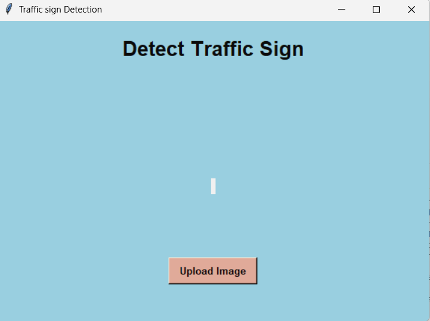
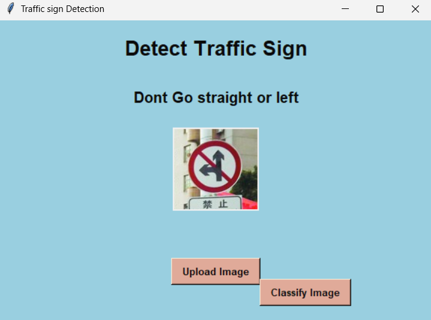
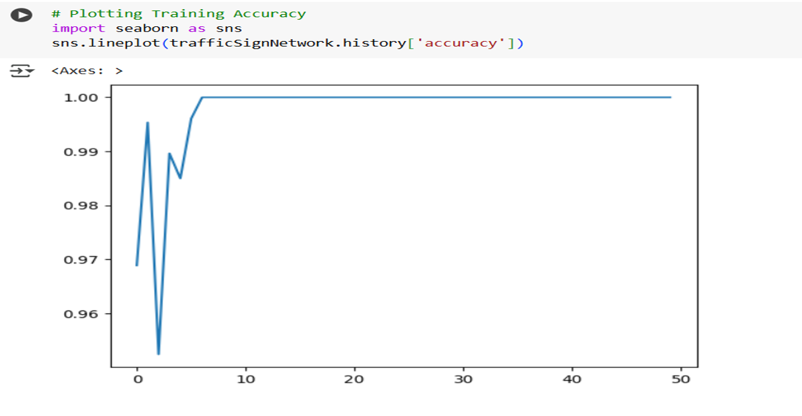

# InsightSign: Deep Learning Traffic Sign Recognition System

## 🚀 Overview
InsightSign is a CNN-based traffic sign recognition system that achieved **97.8% accuracy** in classifying traffic signs across 58 categories. The system uses deep learning for automated pattern recognition and real-time classification, designed for integration in autonomous vehicles and intelligent transportation systems.

## ✨ Key Features
- **High Accuracy**: 97.8% classification accuracy on 6,300+ images
- **Real-time Processing**: Desktop GUI application for instant predictions  
- **Robust Architecture**: CNN-based deep learning model with multiple layers
- **User-friendly Interface**: Tkinter-based GUI for easy image upload and classification
- **Comprehensive Dataset**: Trained on diverse traffic sign categories (58 classes)

## 🛠️ Tech Stack
- **Language:** Python
- **Deep Learning:** TensorFlow/Keras
- **Computer Vision:** OpenCV
- **GUI Framework:** Tkinter
- **Data Processing:** NumPy, Pandas
- **Visualization:** Matplotlib
- **Development Platform:** Google Colab (training), VS Code (deployment)

## 📊 Performance Metrics
- **Training Accuracy:** 97.8%
- **Dataset Size:** 6,300+ images
- **Categories:** 58 traffic sign classes
- **Model Architecture:** Multi-layer CNN with Conv2D, MaxPooling, Dense layers
- **Training Epochs:** 50 epochs with early stopping

## 📋 Prerequisites
- Python 3.8+
- TensorFlow 2.x
- OpenCV
- NumPy, Matplotlib
- Tkinter (usually comes with Python)

## 🖥️ Installation & Setup

1. **Clone this repository**

   git clone https://github.com/Awaissyed12/insightsign.git
   cd insightsign

2. **Install required packages**
   pip install -r requirements.txt

3. **Download the trained model** (if not included)
- The trained model `traffic_sign_model.h5` should be in the `models/` folder
- If missing, run the training script: `python src/model_training.py`

4. **Run the application**

   python src/app.py

## 📁 Project Structure

insightsign/
├── src/ # Source code
├── data/ # Sample data and dataset info
├── models/ # Trained model files
├── screenshots/ # Application screenshots
├── docs/ # Documentation and research paper
├── README.md
├── requirements.txt
└── .gitignore

## 🖼️ Screenshots

*InsightSign application interface for traffic sign classification*

*Sample traffic sign prediction with 97.8% accuracy*

*CNN model training accuracy over 50 epochs*

## 🎯 Usage

1. **Launch the application:**
   python src/app.py

2. **Upload a traffic sign image** using the "Upload Image" button

3. **Click "Classify Image"** to get the prediction

4. **View results** showing the predicted traffic sign class with confidence

## 🧠 Model Architecture

- **Input Layer:** 90×90 grayscale images
- **Convolutional Layers:** Multiple Conv2D layers with ReLU activation
- **Pooling Layers:** MaxPooling for dimensionality reduction
- **Dense Layers:** Fully connected layers for classification
- **Output Layer:** 58 neurons with Softmax activation

## 📈 Training Details

- **Dataset:** Traffic Sign Dataset (Kaggle)
- **Preprocessing:** Resize to 90×90, grayscale conversion, normalization
- **Optimizer:** Adam
- **Loss Function:** Sparse Categorical Crossentropy
- **Batch Size:** 32
- **Epochs:** 50 with early stopping

## 🔬 Research Paper

This project is documented in a comprehensive research paper available in the `docs/` folder:
- **Title:** "Traffic Sign Recognition System Using CNN Based Approach"
- **Authors:** L. Sujith Kumar, Syed Awais
- **Institution:** Kakatiya Institute of Technology and Science

## 🏆 Results & Impact

- Achieved **97.8% accuracy** on traffic sign classification
- Demonstrated real-time processing capabilities
- Successfully integrated CNN model with user-friendly GUI
- Contributed to autonomous vehicle safety research
- Published research findings in conference paper

## 🚀 Future Enhancements

- Integration with real-time video feed
- Mobile application development
- Multi-language traffic sign support
- Edge device deployment (Raspberry Pi, Jetson Nano)
- Integration with V2X communication systems

## 👤 Author

**Awais Syed**  
- 🎓 Computer Science Student
- 📧 Email: awaissyed1215@gmail.com 
- 🔗 LinkedIn:[https://linkedin.com/in/awais-syed-686b46376]

## 📄 License
This project is licensed under the MIT License - see the [LICENSE](LICENSE) file for details.

## 🙏 Acknowledgments

- Kaggle Traffic Sign Dataset contributors
- TensorFlow and OpenCV communities

